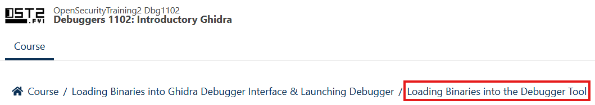

## Overview



The first lab will be working through a few sections of the "Debuggers 1102:
Introductory Ghidra" course on Open Security Training v2, starting at the
`Creating a New Project` section.

**Goals:**

- Set up a ghidra project
- Start getting used to the code browser interface
- Learn how to lookup help in the manual

**Estimated Time:** `20 Minutes`



## Instructions

{}

### Install `Ghidra` in the `Kali Linux` VM.

```bash {filename=Bash}
# Install Java Development Kit
sudo apt update && sudo apt install -y openjdk-21-jdk

# This is where I put ghidra, but you can save it wherever you want.
mkdir -p ~/Tools
cd ~/Tools

# Download Ghidra from the github releases page:
GHIDRA_VERSION='ghidra_11.1.2_PUBLIC_20240709'
curl -OL https://github.com/NationalSecurityAgency/ghidra/releases/download/Ghidra_11.1.2_build/$GHIDRA_VERSION.zip
unzip $GHIDRA_VERSION.zip
ln -s ghidra $GHIDRA_VERSION

# Run ghidra
~/Tools/ghidra/ghidraRun
```

### Start following the steps at the "[Creating a New Project](https://apps.p.ost2.fyi/learning/course/course-v1:OpenSecurityTraining2+Dbg1102_IntroGhidra+2024_v2/block-v1:OpenSecurityTraining2+Dbg1102_IntroGhidra+2024_v2+type@sequential+block@c30b569ec895457192a5886513b4934d)" section.

<!-- <iframe -->
<!-- src="..." -->
<!-- width="576" height="420" title="Introductory Ghidra" scrolling="no" frameborder="0" -->
<!-- /> -->


**Notes:**

- Skip any `Timing Feedback` sections.
- Ignore any references to `fibber.bin` or other binaries.
- You do not need to watch the videos.

### Follow the steps to setup a new project.

### Import a program of your choice into the project.

{}

It doesn't matter which program you choose, `/usr/bin/ping` is a good choice.

{}

### Follow the steps until you get to the `Loading Binaries into the Debugger Tool` section.



### Also review the `Ghidra Tips and Tricks` section.


{}

## Submission

{}

Submit a screenshot of Ghidra to [ELMS](). This could be:

- The main project window with the loaded file
- The code browser tool
- The ghidra manual while viewing the page for the `Listing Window`

{}
