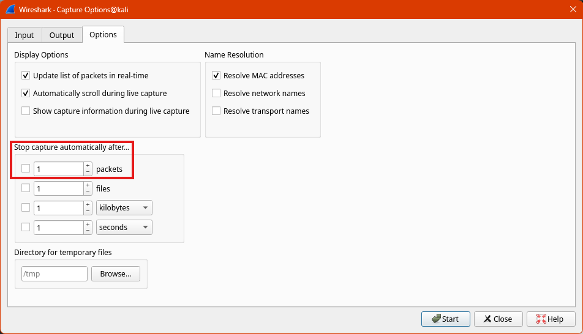
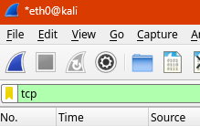

## Overview



In this lab you will practice using the de facto network analysis tool:
Wireshark. You will learn how to use the tool to capture packets, and practice
using the tool to understand what is happening in your local network.

**Goals:**

- Take a packet capture
- Analyze network traffic
  - Learn how to examine packets in wireshark
  - Learn how to filter packets
- Gain a deeper understanding of some network protocols (HTTP, ICMP, etc.)

**Estimated Time:** `45 Minutes`



## Part 1 - Network Capture

{}

### Open wireshark in your Kali linux VM

### Choose the `eth0` interface to capture on (double click it)

### Press the red square to stop the default capture

### In the top menu, go to `Capture > Options`, then choose the `Options` tab in the popup window

### Change the setting and check the box to stop the capture after `100` packets

### Click start capture and `Continue without saving`



Wireshark is really noisy, and you machine is constantly sending packets out so
the data will get really big fast. Retake the capture if you need to make it
smaller.



### Click on the columns to sort the packets and answer the following questions:

1. What protocols do you see?
   - Name the protocol and the port number.
1. What are the ip addresses that you see? Which (if any) is your vm's ip
   address?



**Hints:**

- In the bottom left, you should see some drop down menus for the various
  protocol layers represented in in the packet. The port information should be
  available in the `TCP` or `UDP` section.
- If you can't find it in wireshark, google it! Protocols below layer 3 do not
  have a port number!
- The `ip -c a` command will be helpful



### Type `tcp or udp` in the `Display Filter Bar` to only show TCP based packets



NOTE: I know the picture doesn't match the instructions but I was too lazy to
fix it.



The bar should turn green if the filter is valid. See
[the wireshark wiki](https://wiki.wireshark.org/DisplayFilters) for more info
about how to use display filters.

### Start a new capture, then in the teminal run: `curl http://google.com`

1. Which packet numbers correspond to the `DNS` query?
1. What is the ip address for `google.com`?

### Right click on the first `TCP` packet and choose `Follow > TCP Stream`

1. What
   [HTTP request method](https://developer.mozilla.org/en-US/docs/Web/HTTP/Methods)
   is used to get the content from `google.com`?
1. What is the
   [response code and message](https://developer.mozilla.org/en-US/docs/Web/HTTP/Status)?
1. Does the content match what you see in the curl output?

{}

## Part 2 - Analyze Pcaps

{}

### Analyze the following pcaps and answer the questions:







1. What is the main protocol(s) represented (most amount of packets)? What port
   number(s) if any, does it use?
1. What are the addresses if any of the two hosts communicating?

{}

## Submission



Submit a markdown file with any code you wrote and the answers to questions to
[ELMS](https://umd.instructure.com/courses/1374508/assignments).


