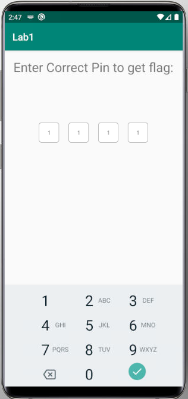

## Description

In this homework you are trying to figure out what the flag is by reverse
engineering an android app. The flag will be in the form of `cygym3{...}`. This
app has two screens, one with a pin (see below) and then a screen displaying the
flag once you've entered the correct pin.

You can download the `.apk` here:



There are a couple ways to tackle this homework:

- Classic static analysis.
- Using dynamic analysis, (but not really).

### Static Method

Since the goal is only to 'get the flag', then you could tailor your analysis to
figure out where the flag is and read it that way. Maybe it's hidden in the
resources, or maybe its constructed in the code? If so, you could try recreating
the java code to construct the flag for you.

### Dynamic (but not really) Method

The application expects you to enter a pin to unlock and view the flag. It does
this at runtime, so I've pulled some relevant artifacts and you should be able
to get the key that way. It looks like they were some encrypted databases but I
don't remember the file names you you'll have to guess which one is which.







You will need to use version 3 of `sqlcipher` to decrypt the databases. The
default one on your kali VM won't work. The one in the following `.zip` file has
been tested on the kali vm. (Read the instructions!)





Once you've figured out the key(s) you can
[decrypt the databases](https://www.zetetic.net/sqlcipher/sqlcipher-api/#key)
and the 4 digit pin will be in one of the tables. To get the flag, I've included
a screenshot of the phone that has been encrypted with the pin.

To decrypt the flag screenshot run `gpg successful_pin_entry.png.gpg` on the
following file.



### A secret 3rd way?!

There's another way I can think of to get the flag, this one will be a secret!
Full points if you submit it as your solution though.

## Tips

- Use the `.tables` SQL comand to list tables in a sqlite database.
- Use `SELECT * FROM <table-name>;` to list the rows in a table.
- Reach out if you can't get sqlcipher to work, that is not a main focus of the
  assignment.

## Submission



Choose one of the methods above (no need to do both) and submit a report with
relevant information to
[ELMS](https://umd.instructure.com/courses/1374508/assignments). For full credit
your report should have the following things:

#### App Triage (`2 pts`):

Analysis of the Manifest and entrypoints.

#### Demonstrte concept/tool understanding (`8 pts`):

Show tool usage and reversing ability.

Explain how relevant code works:

- If you chose the static option, explain how the flag is generated and any code
  you wrote to re-create that process.
- If you chose the dynamic option, explain how the pin is set and walk through
  how you decrypted the databases above.

#### Find the flag (`2 pts`):

Specify the flag value.


