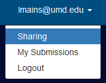
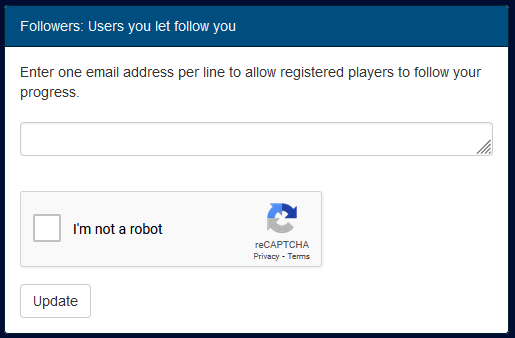

## Description

For this homework assignment you will be working through the first two
challenges of the [NSA Codebreaker Challenge](https://nsa-codebreaker.org). Once
you've created an account make sure to follow the instructions below to add me
as a follower so I can see your progress.

{}

### Navigate to the `sharing` page under your user settings in the top right:

### Enter `lmains@umd.edu` in the `Followers` box and click update:

{}

## Submission



For you submission please submit a screenshot of the codebreaker website or some
text just so the grading tool is happy and I know you've at least signed in to
the website.

- Task 1 is 6 points
- Task 2 is 6 points

I will need to see your progress on the codebreaker site before I will give out
full points. This means you need to add me (`lmains@umd.edu`) as a follower.


