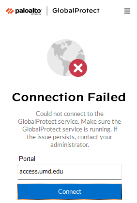
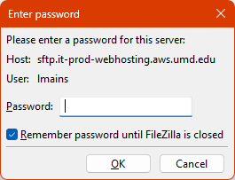
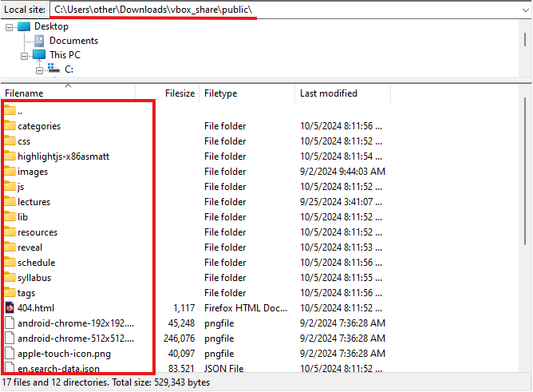
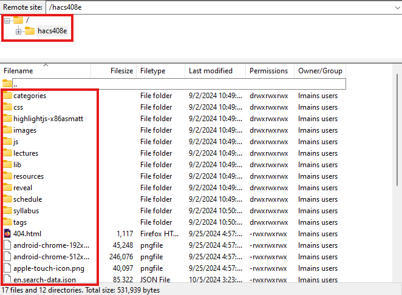
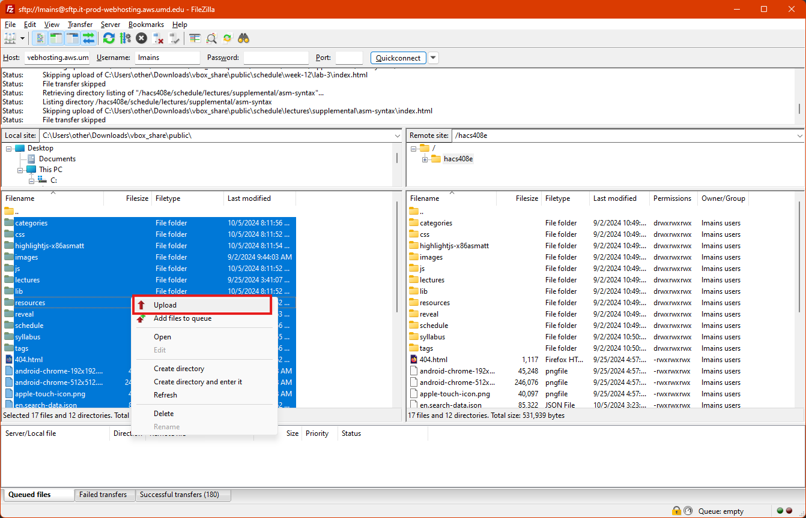

## How to Update the Website

### Step 0 - Build the Site w/ Hugo

If you have [just](https://just.systems/man/en/introduction.html) installed, you
can run `just build`. Otherwise:

```sh
mkdir -p public
rm -rf public/*
hugo
```

### Step 1 - Connect to UMD



**NOTE:** This step is unecessary if you are connected to the Wi-Fi on campus.

### Step 2 - Connect to Web Hosting Platform

In this example i'll be using Filezilla.

Host: `sftp://sftp.it-prod-webhosting.aws.umd.edu` Username: `<your-username>`
Port: `22` (I think this is unecessary if you include the `sftp://` at the
beginning of the hostname)



Navigate to the public directory you genereated files in during `Step 0`.



For the remote end, make sure to double-click into the `hacs408e` directory.



Then once the directories look the same I just upload all the files, overwriting
when something has a different size.


